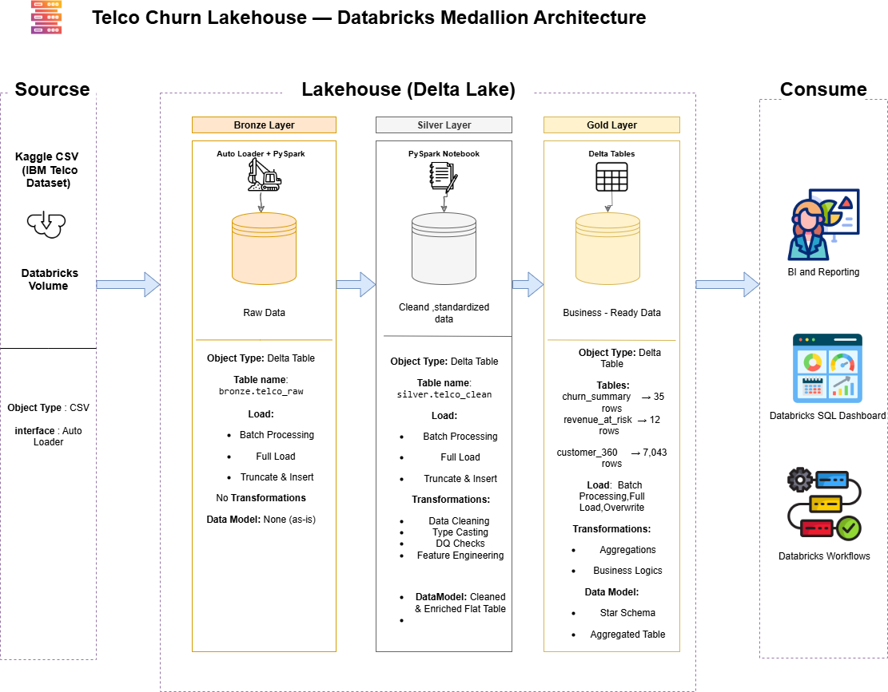
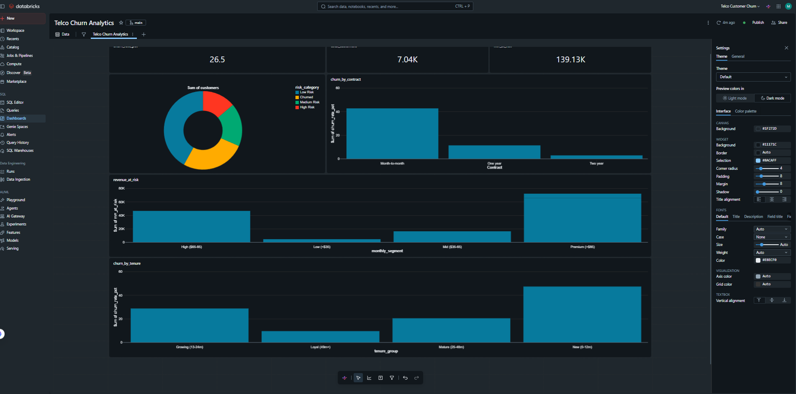

# Telco Churn Lakehouse — Databricks Medallion Architecture

## Project Overview
End-to-end Lakehouse pipeline built on Databricks using the 
IBM Telco Customer Churn dataset. The pipeline follows the 
Medallion Architecture (Bronze → Silver → Gold) with automated 
orchestration via Databricks Workflows.

## Architecture

## Tech Stack
- **Platform:** Databricks Community Edition
- **Storage:** Delta Lake
- **Processing:** PySpark
- **Orchestration:** Databricks Workflows
- **Serving:** Databricks SQL Dashboard
- **Dataset:** IBM Telco Customer Churn (Kaggle) — 7,043 customers

## Medallion Layers

### Bronze — Raw Layer
- Ingestion via Auto Loader
- Stored as-is in Delta format
- Added metadata: ingestion_timestamp, source_file
- Table: `bronze.telco_raw` — 7,043 rows

### Silver — Clean Layer
- Fixed TotalCharges (String → Double)
- Standardized SeniorCitizen (0/1 → Yes/No)
- Added business features: tenure_group, monthly_segment
- Data Quality checks on all critical columns
- Table: `silver.telco_clean` — 7,043 rows

### Gold — Business Layer
- `gold.churn_summary` — Churn rate by contract & tenure (35 rows)
- `gold.revenue_at_risk` — MRR at risk by segment (12 rows)
- `gold.customer_360` — Full customer profile + risk scoring (7,043 rows)

## Key Findings
- Overall churn rate: **26.5%**
- Monthly revenue at risk: **$139,131 / month**
- Highest risk segment: Month-to-month + New customers = **70.2% churn**
- Two-year contracts: **< 5% churn**

## Dashboard

## Pipeline
Automated daily via Databricks Workflows at 2:00 AM
